# Peek.IT-008-Demo

## The Software Development Life Cycle

The SDLC is the journey from **idea** to **operating software**. Each phase represents a different type of engineering thinking:

| Phase        | Purpose                                              |
|--------------|------------------------------------------------------|
| **Goal**     | Understanding what needs to be achieved              |
| **Design**   | Deciding how the solution should work                |
| **Build**    | Creating the actual product                          |
| **Validate** | Proving that it works well                           |
| **Operate**  | Ensuring it performs, survives, and improves in the real world |

---

### Goal — *What are we trying to achieve?*

> Move from idea to outcome, faster and with better decisions.

### Design — *How should the solution work?*

> By turning intent into architecture, structure, and trade-offs.

### Build — *Let's make it real.*

> The solution is implemented, connected, and iterated into a working product.

### Validate — *Does it actually work well?*

> We test, review, debug, and build confidence in the result.

### Operate — *Can it survive and improve in the real world?*

> We monitor, harden, fix, and evolve it continuously.

---

## Application: Operational Incident Assistant

The Operational Incident Assistant helps engineering teams **log, prioritize, assign, and resolve** operational incidents through a simple and structured workflow.

### Business Requirements

- Log new incidents quickly
- Classify incidents by severity
- Assign ownership
- Track incident status
- View and filter all incidents
- Capture incident details and resolution notes
- Validate required data
- Provide basic auditability and operational reliability

---

## Toolkit by SDLC Phase

```mermaid
graph LR
    subgraph Goal
        DocGuard[DocGuard<br><i>Govern requirements</i>]
    end

    subgraph Design
        Iterate[Iterate<br><i>Manage change safely</i>]
    end

    subgraph Build
        SpecSync[Spec Sync<br><i>Continuous alignment</i>]
        Fleet[Fleet Orchestrator<br><i>Human control</i>]
    end

    subgraph Validate
        Verify[Verify<br><i>Assure implementation</i>]
        SpecTest[SpecTest<br><i>Test coverage</i>]
        SecReview[Security Review<br><i>Reduce risk</i>]
    end

    subgraph Operate
        Status[Project Status<br><i>Track progress</i>]
        Health[Health Check<br><i>Assess health</i>]
    end

    Goal --> Design --> Build --> Validate --> Operate

    style Goal fill:#4CAF50,color:#fff
    style Design fill:#2196F3,color:#fff
    style Build fill:#FF9800,color:#fff
    style Validate fill:#9C27B0,color:#fff
    style Operate fill:#F44336,color:#fff
```

### Goal

| Tool | Role |
|------|------|
| **DocGuard** | Govern the requirements |

### Design

| Tool | Role |
|------|------|
| **Iterate** | Manage change safely |

### Build

| Tool | Role |
|------|------|
| **Spec Sync** | Maintain continuous alignment |
| **Fleet Orchestrator** | Keep humans in control |

### Validate

| Tool | Role |
|------|------|
| **Verify** | Assure the implementation |
| **SpecTest** | Validate through test coverage |
| **Security Review** | Reduce delivery risk |

### Operate

| Tool | Role |
|------|------|
| **Project Status** | Track where we are |
| **Project Health Check** | Assess overall health |